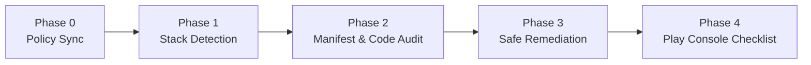

# 🛡️ Google Play Policy Review Agent Skills

[](https://skills.sh/piyush-vrma/google-play-policy-review-skills)
[](LICENSE)
[](#supported-ecosystems)
[](#policy-enforcement-matrix-2026-baseline)

A production-grade skill for AI coding agents that audits Android apps against Google Play Developer Program Policies, detects manifest and permission violations, safely remediates offending code, and generates formal appeal blueprints for rejected or terminated accounts.

Works seamlessly with **Claude Code**, **Antigravity**, **Cursor**, **Cline**, **Windsurf**, **OpenCode**, **Codex**, and any agent running the [skills](https://github.com/vercel-labs/skills) standard.

---

## ⚡ What It Does

- **Full Pre-Submission Audits**: Scans apps before Play Store submission to catch rejections before Google's automated or human reviewers do.
- **Deep Merged-Manifest Awareness**: Detects SDK-injected permissions (`READ_MEDIA_IMAGES`, `ACCESS_BACKGROUND_LOCATION`, `QUERY_ALL_PACKAGES`) injected covertly by third-party libraries.
- **2026 Target SDK Enforcement**: Automatically applies the rolling 1-year rule (API 35 floor, Android 16/API 36, and Android 17/API 37 recommendations).
- **Modern Permission Upgrades**: Automatically refactors legacy media permissions to Android Photo Picker (`PickVisualMedia`), Contact Picker, and system Location buttons.
- **Monetization & Ad Compliance**: Validates Google Play Billing v7+ for digital goods vs third-party processors for physical goods, verifies AdMob IAB TCF v2.3 European consent, and checks ad placement hygiene.
- **Child & Family Safety (COPPA)**: Enforces zero `AD_ID` transmission for child-directed apps and verifies neutral age screens for mixed-audience apps.
- **180-Day Appeal Hard Window**: Automatically calculates remaining appeal windows and generates structured 5-Pillar **Plan of Action (POA)** appeal documents for account suspensions and terminations.
- **Safe, Non-Speculative Remediation**: Provides exact line-by-line diffs, preserves data migrations, and avoids arbitrary code rewrites.

---

## 🚀 Install

### Using `npx skills`

Install into your current project:
```bash
npx skills add piyush-vrma/google-play-policy-review-skills --skill google-play-policy-review
```

Install globally across all supported coding agents:
```bash
npx skills add piyush-vrma/google-play-policy-review-skills --skill google-play-policy-review -g
```

Install for a specific agent (e.g. Claude Code):
```bash
npx skills add piyush-vrma/google-play-policy-review-skills --skill google-play-policy-review -a claude-code
```

> Compatible with **Claude Code**, **Antigravity**, **Cursor**, **Windsurf**, **OpenCode**, **Cline**, **Codex**, and any agent supporting the open [skills](https://github.com/vercel-labs/skills) CLI standard.

### Manual Install

```bash
# For Claude Code
git clone https://github.com/piyush-vrma/google-play-policy-review-skills.git ~/.claude/skills/google-play-policy-review

# For Antigravity / Cursor (.agents/skills)
git clone https://github.com/piyush-vrma/google-play-policy-review-skills.git .agents/skills/google-play-policy-review
```

---

## 🛠️ Usage

Once installed, trigger the skill naturally in your conversation with your coding agent:

```text
Audit my Android app before submitting to Google Play Store.
```

The skill detects your framework, inspects manifests and build configurations, highlights violations with file and line citations, and provides safe remediation code.

### Example Prompts

#### 1. Pre-Submission Full Audit
> *"Audit my React Native app for Google Play Store compliance. Check targetSdk, manifest permissions, billing, and privacy policy requirements."*

#### 2. Rejection Triage & Permission Migration
> *"Google Play rejected my Flutter app under the Photo and Video Permissions policy. Help me diagnose why `READ_MEDIA_IMAGES` was flagged and migrate my code to the system Photo Picker."*

#### 3. Ads, Consent & COPPA Verification
> *"Check my app's AdMob implementation. I need to make sure my UMP SDK setup complies with IAB TCF v2.3 in the EU and that no AD_ID is requested for users under 13."*

#### 4. Account Termination Appeal (POA)
> *"Google terminated my Play Console developer account citing Prior Violations and Associated Accounts. Today is day 20 of my 180-day window. Help me draft a formal 5-Pillar Plan of Action appeal."*

---

## 💡 Better Prompt Tips

For the fastest and most accurate audit:
1. **Specify your framework**: Mention if you are on Native Kotlin/Java, Flutter, React Native, Expo, KMP, .NET MAUI, or Unity.
2. **Share rejection details**: If you received a rejection email, paste the exact policy name, issue description, and APK/AAB version code.
3. **Mention target audience**: State whether your app is designed for children, general audience, or mixed audience (COPPA).
4. **Include manifest files**: Point your agent to your `AndroidManifest.xml`, `pubspec.yaml`, `app.json`, or `build.gradle` files.
5. **State monetization model**: Mention whether your app sells digital items (Play Billing required) or physical goods/services.

---

## 📱 Supported Ecosystems

The skill automatically detects your project type and inspects framework-specific markers:

| Ecosystem | Detection Markers | Critical Inspection Targets |
|---|---|---|
| **Native Android** | `build.gradle`, `build.gradle.kts`, `app/src/main/AndroidManifest.xml` | Merged manifests, runtime permissions, targetSdk, foreground services |
| **Flutter** | `pubspec.yaml`, `lib/main.dart`, `android/app/` | Plugins (`permission_handler`, `photo_manager`), platform channels |
| **React Native** | `package.json` (`react-native`), `android/` | Native modules, permissions libraries, JS bundle OTA hygiene |
| **Expo** | `app.json`, `app.config.js`, `eas.json` | `expo.android.permissions`, `expo.plugins` build-time permission injections |
| **Kotlin Multiplatform** | `build.gradle.kts` (`multiplatform`), `composeApp/` | Shared vs Android manifest, targetSdk declarations |
| **.NET MAUI** | `.csproj` (`Microsoft.Maui`), `Platforms/Android/` | Manifest declarations, dependency permissions |
| **Cordova / Ionic** | `config.xml`, `ionic.config.json`, `platforms/android/` | Plugin XMLs, webview bridge permissions |
| **Capacitor** | `capacitor.config.ts/json`, `android/app/` | Capacitor plugins, native bridge permissions |
| **Unity** | `ProjectSettings/`, `.unity`, Gradle export | Exported AndroidManifest, targetSdk in PlayerSettings |

---

## 📋 Policy Enforcement Matrix (2026 Baseline)

| Policy Area | Requirement / Floor | Common Violation Trigger | Required Remediation |
|---|---|---|---|
| **Target SDK** | API 35 (Android 15) min; API 36/37 recommended | `targetSdkVersion < 35` in build scripts | Bump `targetSdkVersion` to 35+ and audit runtime permission changes |
| **Photo & Video Access** | System Photo Picker (`PickVisualMedia`) | Requesting `READ_MEDIA_IMAGES` without dedicated gallery core need | Replace permission request with `ActivityResultContracts.PickVisualMedia` |
| **Contacts Access** | Android 17+ Contact Picker (`ACTION_PICK_CONTACTS`) | `READ_CONTACTS` requested for one-time contact sharing | Switch to contact picker intent; no runtime permission required |
| **Location** | Location Button for one-time; Background justification | `ACCESS_BACKGROUND_LOCATION` declared without core background feature | Remove background location; use foreground service with valid type |
| **Billing** | Google Play Billing Library v7+ | Third-party checkout (Stripe/PayPal) for digital items/coins/VIP | Implement Play Billing for digital goods; restrict third-party gateways to physical goods |
| **Ads & Consent** | AdMob with IAB TCF v2.3 European consent | Uncertified CMP, ads on splash screens, or interstitials not closeable in 15s | Upgrade UMP SDK, enforce TCF v2.3 strings, fix interstitial timeouts |
| **Families & COPPA** | Zero `AD_ID`, neutral age gates | `AD_ID` requested in child apps; biased age selector | Remove `AD_ID` permission, use self-certified Families ad networks, add neutral age screen |
| **Account Appeals** | Strict 180-day hard appeal deadline | Submitting generic "we apologize" email without root cause | Draft structured 5-Pillar Plan of Action (POA) addressing identity, network, and code fixes |

---

## 🔍 Classification Standards

Every finding generated by the skill uses a standardized 4-tier classification:

- 🔴 **`Confirmed violation`**: A clear breach detected in source code or configuration (e.g., targetSdk below minimum, forbidden permission declared).
- 🟡 **`Policy risk`**: Code patterns that frequently trigger Google automated scanners or manual reviewer flags (e.g., third-party SDKs requesting broad access).
- 🔵 **`Needs Play Console verification`**: Compliance items configured outside the codebase (e.g., Data Safety form answers, store listing descriptions, government app declarations).
- 🟢 **`Not applicable`**: Policy areas reviewed and verified not relevant to this app.

---

## 📁 Skill Architecture

```
.agents/skills/google-play-policy-review/
├── SKILL.md                     # Core workflow orchestration (< 250 lines)
├── policy-sync-log.md           # Policy baseline version & delta records
├── references/                  # Progressive-disclosure modular guides
│   ├── policy-core.md           # Target SDK, permissions, privacy policy, background services
│   ├── ads-monetization.md      # Play Billing v7+, AdMob, IAB TCF v2.3, ad placement hygiene
│   ├── framework-guides.md      # Detection markers across all 9 supported frameworks
│   ├── native-checks.md         # Kotlin/Java manifest merges, runtime permissions, pickers
│   ├── cross-platform-checks.md # Flutter, React Native, Expo, KMP, MAUI, Unity patterns
│   └── recovery-appeals.md      # 180-day hard deadline & 5-Pillar Plan of Action generator
└── evals/                       # Automated benchmark test suite & assertions
    ├── eval-test-cases.json     # 6 realistic pre-submission & recovery test scenarios
    └── run-evals.js             # Automated runner & scoring harness
```

---

## 🔄 Audit & Remediation Workflow



1. **Phase 0: Policy Sync**: Evaluates current policy baseline against the latest enforcement rules.
2. **Phase 1: Ecosystem Detection**: Identifies whether the project is Native, Flutter, React Native, Expo, KMP, etc.
3. **Phase 2: Deep Audit**: Analyzes manifests, dependencies, permissions, billing, and ads with file and line citations.
4. **Phase 3: Remediation**: Generates minimal, safe code fixes (e.g., Photo Picker migration, billing refactor).
5. **Phase 4: Console Checklist**: Provides step-by-step instructions for Data Safety, app content declarations, and store listing disclosures.

---

## 🤝 Contributing

Contributions are warmly welcome! Whether you are adding inspection patterns for new SDKs, updating policy deltas, or expanding cross-platform framework coverage:

1. Check existing issues or open a new one to propose a change.
2. Follow the Anthropics `skill-creator` specification (keep `SKILL.md` under 250 lines, organize deep docs in `references/`).
3. Run the evaluation suite with `npm test` or `node .agents/skills/google-play-policy-review/evals/run-evals.js`.

---

## 📜 License

Distributed under the [MIT License](LICENSE).
